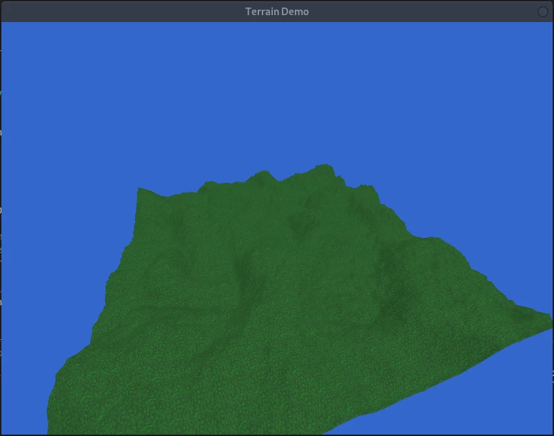

[](https://github.com/TheDudeFromCI/WraithEngine/actions)
[](https://sonarcloud.io/dashboard?id=TheDudeFromCI_WraithEngine)
[](https://sonarcloud.io/dashboard?id=TheDudeFromCI_WraithEngine)
[](https://sonarcloud.io/dashboard?id=TheDudeFromCI_WraithEngine)
[](https://sonarcloud.io/dashboard?id=TheDudeFromCI_WraithEngine)
[](https://sonarcloud.io/dashboard?id=TheDudeFromCI_WraithEngine)
[](https://bettercodehub.com/)

---

# <div align="center">WraithEngine</div>
*<p align="justify">WraithEngine is a free, open-source, Java-based game engine built on top of LWJGL. It is designed to use high-level API for creating games quickly and easily. It is designed to allow users to be able to browse and modify the engine to fit their needs, and only apply components which are relivant for their projects.</p>*

---

#### Java Version

Starting with build 27, Java 13 is now the targeted version being used to compile the project. (Previously version 8.)

## Screenshots




## Getting Started

WraithEngine primarily uses Maven for package management, but for users who wish to use their own package management system, the jar file and dependencies can be found in the releases tab.

### Setting Up Maven

If your project uses a Maven workflow, the following dependency should be added to your pom.xml file:

```
<dependency>
    <groupId>net.whg</groupId>
    <artifactId>wraithengine</artifactId>
    <version>BUILD_NUMBER</version>
</dependency>
```

Replace BUILD*NUMBER with the build number you wish to use, in the format `build*#`. Or,`build_3` to use build 3, for example.

As WraithEngine uses the Github Package Repository, you must also add this repository to your project in order to access WraithEngine. This can be done by modifying your Maven settings.xml file. This file is a Maven user settings file, which tells Maven useful tips such as what servers to check to resolve dependencies, and account information for logging in to those servers to access them. This file is found at `USER_HOME_FOLDER/.m2/settings.xml`.

For individuals using Linux, this is usually: `/home/USERNAME/.m2/settings.xml`
<br>
For individuals using Windows, this is usually: `C:\Users\USERNAME\.m2\settings.xml`
<br>
For individuals using Mac, this is usually: `/Users/USERNAME/.m2/settings.xml`

If you're using a custom workflow, you can also create a separate settings.xml file specific to your current project. Simply use the `--settings PATH/TO/SETTINGS` flag when calling Maven commands to use a custom settings file.

If the file does not exist, create it. After creating it, you want to add the following repositories and server tags. You should modify your file to look like this. (See profiles and servers) This basically tells Maven where to look for the WraithEngine package at. Due to how Github is set up, you also must have a Github API token created to allow you to download packages remotely, even though they're open source. This can be seen below in the `<servers>` tag.

```
<settings xmlns="http://maven.apache.org/SETTINGS/1.0.0"
  xmlns:xsi="http://www.w3.org/2001/XMLSchema-instance"
  xsi:schemaLocation="http://maven.apache.org/SETTINGS/1.0.0
                      http://maven.apache.org/xsd/settings-1.0.0.xsd">

  <activeProfiles>
    <activeProfile>github</activeProfile>
  </activeProfiles>

  <profiles>
    <profile>
      <id>github</id>
      <repositories>
        <repository>
          <id>central</id>
          <url>https://repo1.maven.org/maven2</url>
          <releases><enabled>true</enabled></releases>
          <snapshots><enabled>false</enabled></snapshots>
        </repository>

        <repository>
          <id>github</id>
          <name>GitHub thedudefromci Apache Maven Packages</name>
          <url>https://maven.pkg.github.com/thedudefromci/WraithEngine</url>
        </repository>
      </repositories>
    </profile>
  </profiles>

  <servers>
    <server>
      <id>github</id>
      <username>USERNAME</username>
      <password>API_TOKEN</password>
    </server>
  </servers>
</settings>
```

Replace `USERNAME` with your Github username in all lowercase letters. Replace `API_TOKEN` with your Github API token.

If you're unsure how to create a Github API token, go into your user settings, and select Developer settings. Select Personal Access Tokens, and generate a new token that specific to the device you are working on. Make sure to give it the "read:packages" flag.

**Note:**
Keep this token secret! This is a basically a password which allows software to access your account. This should be kept a secret! If your API token is ever compromised, delete it and create a new token.

### Jar Download

If your currently workflow does not use Maven, all builds, starting from build 14, can be found in the releases menu about. The libraries which WraithEngine relies on can be found next to the release zip.

## Contributing

WraithEngine is open-source and community-driven. All contributions are welcome and highly encouraged! If you see an area of the project which is lacking, feel free to open an issue or submit a pull request. If you want to help but aren't sure where to start:

- Test Coverage

  Extra tests are always awesome! They help prevent potential bugs and improve the stability of areas of the project which might have been overlooked in the past. If you think of some important tests which weren't originally added, feel free to submit them.

- Documentation

  Sometimes documentation is poorly worded or doesn't properly explain what's going on. If you think of a better way of explaining something, or just generally tweaking the grammer and formatting, go for it.

- Bug Fixes

  This is a pretty straight forward one. Bugs happen, and they suck, a lot. But if you have some time to squash a few of them, the community would greatly appreciate it!

- Features and Enhancements

  These are the realy big ones, for the brave. If you see a crucial feature on the todo list, that's really taking far too long to be implemented, feel free to get the ball rolling. It keeps things moving and ensures that the most important features actually make it into the project.

---

If this project is something that has helped you, please consider donating. Many hours have gone into the development of this project and I would immesly appreciate it. It helps me continue doing what I love, making open source game assets. Thank you.

<p align="center"><a href="https://www.paypal.com/cgi-bin/webscr?cmd=_donations&business=6U3RFW3H3Y7AU&currency_code=USD&source=url"></a></p>
